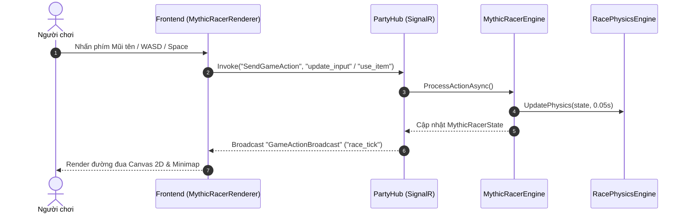

# 📘 Developer Guide - Myth4Ever5 Platform

Tài liệu này dành cho Lập trình viên (Developers) tìm hiểu toàn bộ cấu trúc dự án, nguyên lý thiết kế (Design Principles), cách thiết lập môi trường phát triển và quy trình mở rộng hệ thống **Myth4Ever5**.

---

## 📋 Mục Lục
1. [Tổng Quan Công Nghệ](#1-tổng-quan-công-nghệ)
2. [Chi Tiết Backend (.NET 9 ASP.NET Core)](#2-chi-tiết-backend-net-9-aspnet-core)
3. [Chi Tiết Frontend (Vanilla JS SPA & Canvas 2D)](#3-chi-tiết-frontend-vanilla-js-spa--canvas-2d)
4. [Quy Trình Xử Lý Một Hành Động (Action Lifecycle)](#4-quy-trình-xử-lý-một-hành-động-action-lifecycle)
5. [Hướng Dẫn Debug & Deploy Render](#5-hướng-dẫn-debug--deploy-render)

---

## 1. Tổng Quan Công Nghệ

- **Backend**: C# .NET 9.0 Web API & SignalR Hub.
- **Frontend**: Vanilla JavaScript (ES6 Modules), HTML5 Canvas 2D Engine, Custom Modular CSS (Dark Purple & Glassmorphism Design System).
- **Realtime Protocol**: WebSockets qua ASP.NET Core SignalR.
- **Audio Engine**: Web Audio API synthesizer (`sound-fx.js`).
- **Physics Engine**: Kinematics top-down racer engine (`RacePhysicsEngine.cs`).
- **Containerization**: Docker Multi-stage build (`Dockerfile`).

---

## 2. Chi Tiết Backend (.NET 9 ASP.NET Core)

### Cấu Trúc Các Lớp (Class Layering):

#### `PartyHub.cs` (`Core/Hubs/PartyHub.cs`)
Cổng giao tiếp duy nhất giữa Frontend và Backend qua SignalR Hub.
- `CreateRoom`: Tạo phòng mới, gán người tạo làm Host (`IsHost = true`).
- `JoinRoom`: Cho phép người chơi gia nhập phòng theo giới hạn động per game.
- `ToggleReady`: Cho phép thành viên chuyển trạng thái Sẵn Sàng.
- `SelectGame`: Chủ phòng chọn trò chơi (`mythic_cards`, `number_bomb`, `hexahive`, `mythic_racer`).
- `StartGame`: Kiểm tra số lượng người chơi tối thiểu & trạng thái Ready của cả phòng trước khi khởi tạo game.
- `SendGameAction`: Chuyển tiếp hành động trong game đến Engine tương ứng.

#### `RoomManager.cs` & `GameEngineFactory.cs`
Áp dụng Factory Pattern & Reflection để tự động tìm tất cả các lớp triển khai `IGameEngine` khi ứng dụng khởi động.

#### Mythic Racer Engine & Physics Subsystems (`Games/MythicRacer/`)
- `CarModel.cs`: Kinematics 2D car position, angle, speed, current lap, checkpoints, item slot, shield/spinout status.
- `TrackDefinition.cs` & `TrackRegistry.cs`: Hệ thống Track Registry mở rộng map dễ dàng, khai báo đường đua F1 Grand Prix với Hairpins, S-Bends, Checkpoints & lề cỏ làm chậm.
- `RacePhysicsEngine.cs`: Gia tốc, ma sát, bẻ lái, phạt lề cỏ 55%, va chạm vỏ chuối/tên lửa, đếm số lap (3 Laps) & thứ hạng.
- `MythicRacerEngine.cs`: Implement `IGameEngine` (`gameTypeId = "mythic_racer"`).

---

## 3. Chi Tiết Frontend (Vanilla JS SPA & Canvas 2D)

### Submodule Giao Diện Mythic Racer (`js/games/mythic-racer-renderer.js`):
- **Canvas 2D Racing Engine**: Render đường đua F1, vệt bánh xe (Skid marks), khói Nitro, đèn pha, Minimap realtime góc trên bên phải.
- **HUD & Winner Podium Modal**: Lap badge (`LAP 2/3`), Rank position, Item Slot, Cúp Vô Địch 🏆 1st, 2nd, 3rd, 4th.
- **Dual Controls**: Event listener Bàn phím PC (`↑↓←→` / `WASD` + `Space`) & Touch Buttons ảo trên Mobile.

---

## 4. Quy Trình Xử Lý Một Hành Động (Action Lifecycle)



---

## 5. Hướng Dẫn Debug & Deploy Render

### Chạy và Kiểm Tra Cục Bộ:
```bash
# Trong thư mục Backend/Myth4Ever5.Api
dotnet build
dotnet run
```
