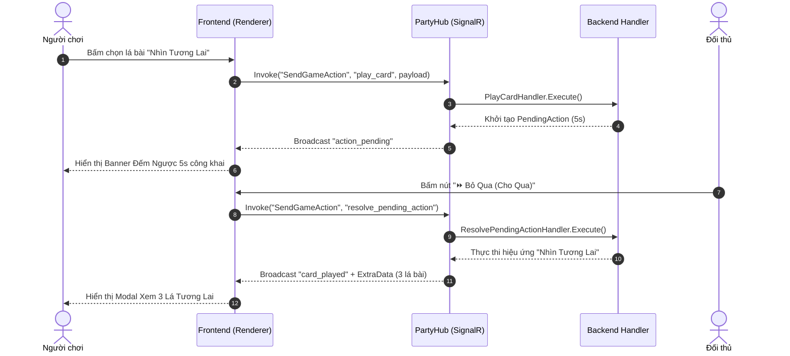

# 📘 Developer Guide - Myth4Ever5 Platform

Tài liệu này dành cho Lập trình viên (Developers) tìm hiểu toàn bộ cấu trúc dự án, nguyên lý thiết kế (Design Principles), cách thiết lập môi trường phát triển và quy trình mở rộng hệ thống **Myth4Ever5**.

---

## 📋 Mục Lục
1. [Tổng Quan Công Nghệ](#1-tổng-quan-công-nghệ)
2. [Chi Tiết Backend (.NET 9 ASP.NET Core)](#2-chi-tiết-backend-net-9-aspnet-core)
3. [Chi Tiết Frontend (Vanilla JS SPA)](#3-chi-tiết-frontend-vanilla-js-spa)
4. [Quy Trình Xử Lý Một Hành Động (Action Lifecycle)](#4-quy-trình-xử-lý-một-hành-động-action-lifecycle)
5. [Hướng Dẫn Debug & Deploy Render](#5-hướng-dẫn-debug--deploy-render)

---

## 1. Tổng Quan Công Nghệ

- **Backend**: C# .NET 9.0 Web API & SignalR Hub.
- **Frontend**: Vanilla JavaScript (ES6 Modules), Custom Modular CSS (Dark Purple & Glassmorphism Design System), HTML5.
- **Realtime Protocol**: WebSockets qua ASP.NET Core SignalR.
- **Audio Engine**: Web Audio API synthesizer (`sound-fx.js`).
- **Containerization**: Docker Multi-stage build (`Dockerfile`).

---

## 2. Chi Tiết Backend (.NET 9 ASP.NET Core)

### Cấu Trúc Các Lớp (Class Layering):

#### `PartyHub.cs` (`Core/Hubs/PartyHub.cs`)
Cổng giao tiếp duy nhất giữa Frontend và Backend qua SignalR Hub.
- `CreateRoom`: Tạo phòng mới, gán người tạo làm Host (`IsHost = true`).
- `JoinRoom`: Cho phép người chơi gia nhập phòng (mặc định `IsReady = false`).
- `ToggleReady`: Cho phép thành viên chuyển trạng thái Sẵn Sàng.
- `SelectGame`: Chủ phòng chọn trò chơi (`mythic_cards` hoặc `number_bomb`).
- `StartGame`: Kiểm tra số lượng người chơi tối thiểu & trạng thái Ready của cả phòng trước khi khởi tạo game.
- `SendGameAction`: Chuyển tiếp hành động trong game đến Engine tương ứng.

#### `RoomManager.cs` (`Core/Services/RoomManager.cs`)
Quản lý trạng thái phòng chơi trong bộ nhớ (`ConcurrentDictionary`). Đảm bảo an toàn thread-safe khi nhiều người cùng kết nối/thao tác.

#### `GameEngineFactory.cs` (`Core/Services/GameEngineFactory.cs`)
Áp dụng Factory Pattern & Reflection để tự động tìm tất cả các lớp triển khai `IGameEngine` khi ứng dụng khởi động.

#### Modular Game Handlers (`Games/MythicCards/Handlers/`)
Đối với game phức tạp như Mythic Cards, logic được chia nhỏ thành các Handler chuyên biệt theo nguyên lý Single Responsibility:
- `DrawCardHandler.cs`: Xử lý rút bài, bốc phải Bão Mộc (Bomb) và trừ máu/loại người chơi.
- `PlayCardHandler.cs`: Xử lý đánh bài đơn/combo, khởi tạo cửa sổ `PendingAction` (5s).
- `SingleCardEffectHandler.cs`: Xử lý hiệu ứng bài đơn (*Skip*, *Attack*, *SeeFuture*, *Shuffle*, *Steal*, *TargetedAttack*, *DrawBottom*, *AlterFuture*, *Favor*).
- `ComboCardEffectHandler.cs`: Xử lý hiệu ứng Combo 2 lá (Cướp bài úp), Combo 3 lá (Đòi loại bài), Combo 5 lá khác loại (Lấy bài từ chồng rác).
- `ExplodingHandler.cs`: Xử lý gài lại lá Bão Mộc vào chồng bài sau khi dùng lá Giải Bẫy (*Defuse*).
- `ResolvePendingActionHandler.cs`: Xử lý kết quả sau khi cửa sổ đếm ngược Chặn (Nope) kết thúc.

---

## 3. Chi Tiết Frontend (Vanilla JS SPA)

### Kiến Trúc Giao Diện (UI Design System):
Giao diện được thiết kế theo phong cách Modern Dark Purple Glassmorphism với các biến màu CSS chuẩn hoá tại `css/style.css`:
- `--bg-dark`: `#0d0b18`
- `--surface-1`: `rgba(23, 20, 41, 0.85)`
- `--purple-accent`: `#8b5cf6`
- `--gold-bright`: `#fbbf24`
- `--crimson-bright`: `#ef4444`

### Các Submodule Giao Diện Mythic Cards (`js/games/mythic-cards/`):
- **`mc-seat-renderer.js`**: Tính toán tọa độ và vẽ các vị trí ghế ngồi của người chơi quanh bàn đấu hình oval.
- **`mc-hand-renderer.js`**: Vẽ bộ bài trên tay của người chơi hiện tại, hỗ trợ chọn nhiều lá để đánh Combo.
- **`mc-timer-renderer.js`**: Hiển thị thanh đếm ngược Bom Nổ và Cửa sổ Chặn (Nope) 5s kèm nút *🛑 Chặn* và *⏩ Bỏ Qua*.
- **`mc-modal-manager.js`**: Quản lý tất cả các cửa sổ tương tác (Modal chọn mục tiêu cướp bài, xem 3 lá tương lai, sắp xếp tương lai, đặt bẫy, nộp bài xin xỏ, popup thông báo kết quả cướp bài).
- **`mc-rules-modal.js`**: Bảng hướng dẫn luật chơi chi tiết.

---

## 4. Quy Trình Xử Lý Một Hành Động (Action Lifecycle)



---

## 5. Hướng Dẫn Debug & Deploy Render

### Chạy và Kiểm Tra Cục Bộ:
```bash
# Trong thư mục Backend/Myth4Ever5.Api
dotnet build
dotnet run
```

### Triển Khai Lên Render:
1. Đảm bảo file `Myth4Ever5.Api.csproj` đặt `<TargetFramework>net9.0</TargetFramework>` (khớp với môi trường Native của Render) hoặc sử dụng file `Dockerfile` đã được tối ưu sẵn.
2. Kiểm tra log khởi chạy trên Render để đảm bảo Kestrel đã bind đúng vào `http://0.0.0.0:${PORT}`.
