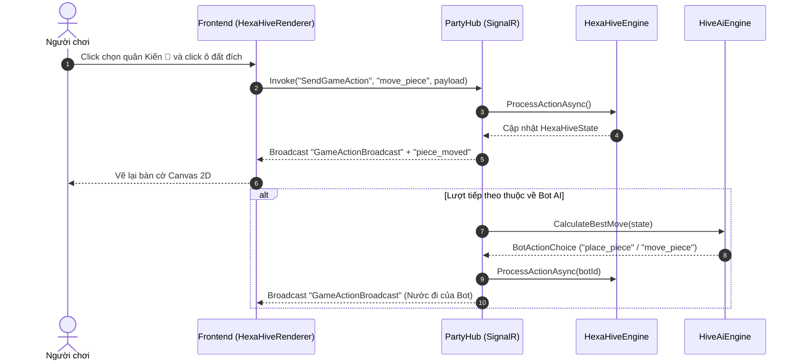

# 📘 Developer Guide - Myth4Ever5 Platform

Tài liệu này dành cho Lập trình viên (Developers) tìm hiểu toàn bộ cấu trúc dự án, nguyên lý thiết kế (Design Principles), cách thiết lập môi trường phát triển và quy trình mở rộng hệ thống **Myth4Ever5**.

---

## 📋 Mục Lục
1. [Tổng Quan Công Nghệ](#1-tổng-quan-công-nghệ)
2. [Chi Tiết Backend (.NET 9 ASP.NET Core)](#2-chi-tiết-backend-net-9-aspnet-core)
3. [Chi Tiết Frontend (Vanilla JS SPA & Canvas 2D)](#3-chi-tiết-frontend-vanilla-js-spa--canvas-2d)
4. [Quy Trình Xử Lý Một Hành Động (Action Lifecycle)](#4-quy-trình-xử-lý-một-hành-động-action-lifecycle)
5. [Hướng Dẫn Debug & Deploy Render](#5-hướng-dẫn-debug--deploy-render)

---

## 1. Tổng Quan Công Nghệ

- **Backend**: C# .NET 9.0 Web API & SignalR Hub.
- **Frontend**: Vanilla JavaScript (ES6 Modules), HTML5 Canvas 2D Engine, Custom Modular CSS (Dark Purple & Glassmorphism Design System).
- **Realtime Protocol**: WebSockets qua ASP.NET Core SignalR.
- **Audio Engine**: Web Audio API synthesizer (`sound-fx.js`).
- **Bot AI Engine**: Heuristic Score-based Grandmaster Evaluator (`HiveAiEngine.cs`).
- **Containerization**: Docker Multi-stage build (`Dockerfile`).

---

## 2. Chi Tiết Backend (.NET 9 ASP.NET Core)

### Cấu Trúc Các Lớp (Class Layering):

#### `PartyHub.cs` (`Core/Hubs/PartyHub.cs`)
Cổng giao tiếp duy nhất giữa Frontend và Backend qua SignalR Hub.
- `CreateRoom`: Tạo phòng mới, gán người tạo làm Host (`IsHost = true`).
- `JoinRoom`: Cho phép người chơi gia nhập phòng theo giới hạn động per game.
- `ToggleReady`: Cho phép thành viên chuyển trạng thái Sẵn Sàng.
- `AddBot`: Cho phép Chủ phòng thêm Bot AI vào game HexaHive để đấu đơn 1v1.
- `KickPlayer`: Cho phép Chủ phòng đuổi người chơi/Bot ra khỏi phòng.
- `SelectGame`: Chủ phòng chọn trò chơi (`mythic_cards`, `number_bomb`, `hexahive`).
- `StartGame`: Kiểm tra số lượng người chơi tối thiểu & trạng thái Ready của cả phòng trước khi khởi tạo game.
- `SendGameAction`: Chuyển tiếp hành động trong game đến Engine tương ứng.

#### `RoomManager.cs` (`Core/Services/RoomManager.cs`)
Quản lý trạng thái phòng chơi trong bộ nhớ (`ConcurrentDictionary`). Đảm bảo an toàn thread-safe khi nhiều người cùng kết nối/thao tác.

#### `GameEngineFactory.cs` (`Core/Services/GameEngineFactory.cs`)
Áp dụng Factory Pattern & Reflection để tự động tìm tất cả các lớp triển khai `IGameEngine` khi ứng dụng khởi động.

#### HexaHive Engine & Subsystems (`Games/HexaHive/`)
- `HexCoord.cs`: Hệ tọa độ Lục Giác Axial $(q, r)$ & vector math 6 hướng.
- `HivePiece.cs`: Model 8 loại quân cờ độc nhất ( Ong Chúa 👑, Kiến 🐜, Nhện 🕷️, Châu Chấu 🦗, Bọ Cánh Cứng 🪲, Bọ Rùa 🐞, Muỗi 🦟, Bọ Cuộn 🛡️).
- `HiveRulesEngine.cs`: Giải thuật BFS đồ thị kiểm tra **One-Hive Rule** (Articulation Points), **Freedom to Slide Rule**, và tính toán nước đi chuẩn 100% quốc tế cho 8 loại quân.
- `HiveAiEngine.cs`: Bộ não Bot AI Grandmaster đánh giá điểm số khai cuộc và phong tỏa Ong Chúa.

---

## 3. Chi Tiết Frontend (Vanilla JS SPA & Canvas 2D)

### Kiến Trúc Giao Diện (UI Design System):
Giao diện được thiết kế theo phong cách Modern Dark Purple Glassmorphism với các biến màu CSS chuẩn hoá tại `css/style.css`:
- `--bg-dark`: `#0d0b18`
- `--surface-1`: `rgba(23, 20, 41, 0.85)`
- `--purple-accent`: `#8b5cf6`
- `--gold-bright`: `#fbbf24`
- `--crimson-bright`: `#ef4444`

### Các Submodule Giao Diện HexaHive (`js/games/`):
- **`hexahive-renderer.js`**: Controller vẽ bàn cờ Lục giác bằng HTML5 Canvas 2D, hỗ trợ Zoom, Pan, Drag & Drop, Căn giữa, và **Glassmorphic GameOver Popup** với tính năng `👀 Xem Bàn Cờ` cuối trận.
- **`hexahive-rules-modal.js`**: Bảng hướng dẫn luật chơi tương tác 3 Tab và tra cứu 24 thế cờ chiến thuật nâng cao.

---

## 4. Quy Trình Xử Lý Một Hành Động (Action Lifecycle)



---

## 5. Hướng Dẫn Debug & Deploy Render

### Chạy và Kiểm Tra Cục Bộ:
```bash
# Trong thư mục Backend/Myth4Ever5.Api
dotnet build
dotnet run
```

### Triển Khai Lên Render:
1. Đảm bảo file `Myth4Ever5.Api.csproj` đặt `<TargetFramework>net9.0</TargetFramework>` (khớp với môi trường Native của Render) hoặc sử dụng file `Dockerfile` đã được tối ưu sẵn.
2. Kiểm tra log khởi chạy trên Render để đảm bảo Kestrel đã bind đúng vào `http://0.0.0.0:${PORT}`.
