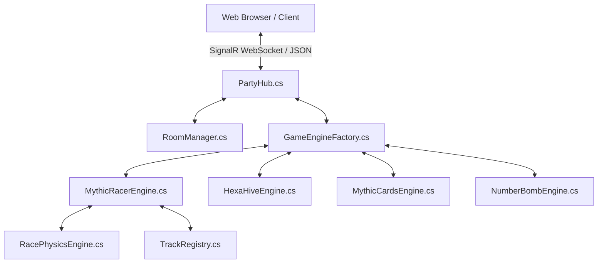

# 🎮 Myth4Ever5 - Multi-Game Board Game Platform

[](https://dotnet.microsoft.com/)
[](https://dotnet.microsoft.com/apps/aspnet/signalr)
[](LICENSE)
[](https://render.com/)

Nền tảng Board Game & Arcade Game trực tuyến đa trò chơi (Multi-Game Online Platform) thời gian thực được xây dựng trên nền tảng **.NET 9 ASP.NET Core SignalR** (Backend) và **Vanilla JavaScript + Modern CSS Glassmorphic + HTML5 Canvas 2D** (Frontend).

---

## 🌟 Trò Chơi Nổi Bật (Featured Games)

### 1. 🏎️ Mythic Racer: Nitro Party 2D (Đua Xe F1 Bắn Súng) (2 - 4 người) ⭐ NEW!
Trò chơi đua xe 2D Top-down kịch tính hấp dẫn (inspired by Mario Kart 2D & Micro Machines)!
- **Đường đua F1 Grand Prix Technical Circuit**: Hệ thống Track Registry dễ mở rộng map, đầy đủ khúc cua gắt Hairpins 180°, cua S-Bends, Checkpoints & lề cỏ phạt giảm tốc 55%.
- **5 Vật phẩm Mario Kart**: Tên lửa đuổi 🚀, Vỏ chuối 360° 🍌, Nitro boost ⚡, Khiên giáp 🛡️, Bom bán kính 💣.
- **Đồ họa Canvas 2D mượt mà**: Vệt bánh xe (Skid marks), khói Nitro, đèn pha, Minimap realtime góc trên bên phải & Cúp Vô Địch 🏆 1st, 2nd, 3rd, 4th.
- **Điều khiển song song**: Bàn phím PC (`↑↓←→` / `WASD` + `Space`) & Touch Buttons cảm ứng Mobile.

### 2. 🐝 HexaHive: Bug Tactics (Cờ Lục Giác Côn Trùng) (1v1 / Solo Vs Bot AI)
Trò chơi cờ chiến thuật Lục Giác đấu trí đỉnh cao (inspired by Hive - Gen42 Games)!
- **8 Loại quân cờ**: *Ong Chúa 👑*, *Kiến 🐜*, *Nhện 🕷️*, *Châu Chấu 🦗*, *Bọ Cánh Cứng 🪲*, *Bọ Rùa 🐞*, *Muỗi 🦟*, *Bọ Cuộn 🛡️*.
- **Bộ Não Bot AI Grandmaster**: Hỗ trợ chế độ chơi đơn solo 1v1 với máy.

### 3. 🎴 Mythic Cards (Mèo Ma Quái / Exploding Kittens) (2 - 4 người)
Trò chơi thẻ bài chiến thuật sinh tồn đầy gay cấn! Rút bài, đặt bẫy, ném bài **Chặn (Nope)** và dùng đủ mọi thủ đoạn để không bị **Bão Mộc (Bẫy Nổ)** thổi bay.

### 4. 💣 Bom Số (Secret Number Bomb) (2 - 8 người)
Trò chơi đoán số đấu trí hồi hộp từ 1 - 100.

---

## 🏗️ Kiến Trúc Hệ Thống (Architecture)



- **Backend (.NET 9 C#)**:
  - **Clean Architecture & SOLID**: Áp dụng Handler Pattern và Engine Auto-Discovery qua Reflection.
  - **Kinematics Physics Engine**: Động học đua xe 2D, ma sát, bẻ lái, va chạm vật phẩm, đếm vòng lap.
  - **SignalR WebSockets**: Đồng bộ trạng thái game (State Synchronization) thời gian thực.
- **Frontend (Vanilla JS + Custom CSS + Canvas 2D)**:
  - **Design System**: Giao diện Dark Purple Glassmorphism hiện đại, hiệu ứng neon, mượt mà.
  - **Modular Renderers**: Tách nhỏ giao diện thành các submodule chuyên biệt (`mythic-racer-renderer`, `hexahive-renderer`, `mythic-cards-renderer`, `number-bomb-renderer`).

---

## 🚀 Hướng Dẫn Chạy Cục Bộ (Local Setup)

### Yêu Cầu Tiền Đề:
- [.NET 9.0 SDK](https://dotnet.microsoft.com/download/dotnet/9.0)

### Các Bước Khởi Chạy:
1. **Clone repository**:
   ```bash
   git clone https://github.com/MythNovem/Myth4Ever5.git
   cd Myth4Ever5
   ```

2. **Chạy Backend**:
   ```bash
   cd Backend/Myth4Ever5.Api
   dotnet run
   ```

3. **Truy cập ứng dụng**:
   Mở trình duyệt và truy cập: `http://localhost:5000`.

---

## 📂 Cấu Trúc Thư Mục (Directory Structure)

```text
Myth4Ever5/
├── Backend/
│   └── Myth4Ever5.Api/
│       ├── Core/
│       │   ├── Hubs/             # SignalR PartyHub.cs
│       │   ├── Interfaces/       # IGameEngine.cs
│       │   ├── Models/           # RoomModel.cs, PlayerModel.cs
│       │   └── Services/         # RoomManager.cs, GameEngineFactory.cs
│       └── Games/
│           ├── MythicRacer/      # Game Engine #1 (Đua Xe F1 2D & Track Registry) ⭐ NEW!
│           ├── HexaHive/         # Game Engine #2 (Cờ Lục Giác & Bot AI Engine)
│           ├── MythicCards/      # Game Engine #3 & Handlers
│           └── NumberBomb/       # Game Engine #4
├── Frontend/
│   ├── css/                      # Custom Glassmorphism Stylesheet
│   ├── js/
│   │   ├── core/                 # lobby-manager, signalr-service, sound-fx
│   │   └── games/                # Game renderers (mythic-racer, hexahive, mythic-cards, number-bomb)
│   └── index.html                # Main SPA Layout
├── AGENTS.md                     # Tài liệu hướng dẫn dành cho AI Agent
├── DEVELOPER_GUIDE.md            # Tài liệu chi tiết dành cho Developer
└── README.md                     # Tài liệu tổng quan dự án
```

---

## 📝 Giấy Phép (License)
Dự án được phân phối dưới giấy phép [MIT License](LICENSE).