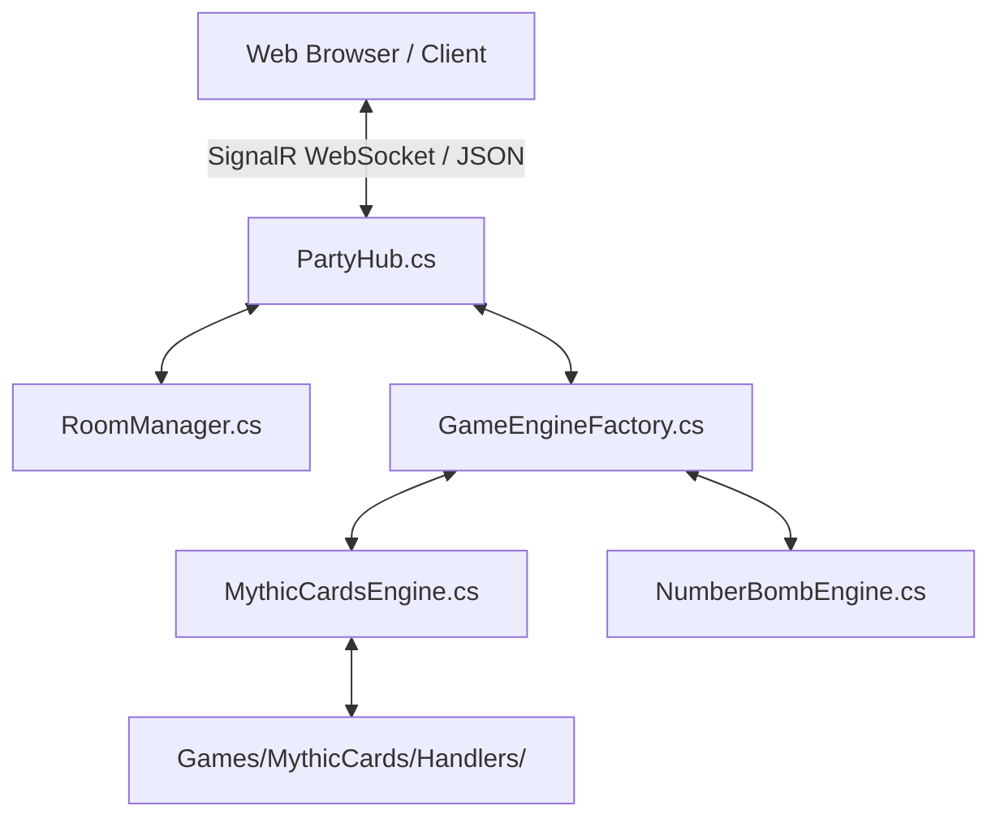

# 🎮 Myth4Ever5 - Multi-Game Board Game Platform

[](https://dotnet.microsoft.com/)
[](https://dotnet.microsoft.com/apps/aspnet/signalr)
[](LICENSE)
[](https://render.com/)

Nền tảng Board Game trực tuyến đa trò chơi (Multi-Game Online Platform) thời gian thực được xây dựng trên nền tảng **.NET 9 ASP.NET Core SignalR** (Backend) và **Vanilla JavaScript + Modern CSS Glassmorphism** (Frontend).

---

## 🌟 Trò Chơi Nổi Bật (Featured Games)

### 1. 🎴 Mythic Cards (Mèo Ma Quái / Exploding Kittens) (2 - 4 người)
Trò chơi thẻ bài chiến thuật sinh tồn đầy gay cấn! Rút bài, đặt bẫy, ném bài **Chặn (Nope)** và dùng đủ mọi thủ đoạn để không bị **Bão Mộc (Bẫy Nổ)** thổi bay.
- **Thẻ bài đặc biệt**: *Bão Mộc 💣*, *Giải Bẫy 🛠️*, *Chặn (Nope) 🛑*, *Ép Lượt 🔄*, *Nhìn Tương Lai 👁️*, *Thay Đổi Tương Lai 🔮*, *Tráo Bài 🔀*, *Rút Đáy ⏬*, *Xin Xỏ 🙏*, *Cướp Bài 🎁*, *🎯 Ám Sát*, *Combo 2/3/5 lá bài thường*.
- **Cửa sổ phản hồi Chặn (Nope)**: Đếm ngược 5 giây công khai tên lá bài, cho phép đối thủ ném Chặn hoặc bấm **⏩ Bỏ Qua (Cho Qua)** để tăng tốc độ chơi.

### 2. 💣 Bom Số (Secret Number Bomb) (2 - 8 người)
Trò chơi đoán số đấu trí hồi hộp! Quả bom bí mật nằm ẩn trong khoảng **1 - 100**. Người chơi lần lượt chọn số để bóp chặt khoảng an toàn. Ai đoán trúng số Bom sẽ bị phát nổ và loại khỏi cuộc chơi!

---

## 🏗️ Kiến Trúc Hệ Thống (Architecture)



- **Backend (.NET 9 C#)**:
  - **Clean Architecture & SOLID**: Áp dụng Handler Pattern tách biệt từng loại thẻ bài và hành động.
  - **Auto-Discovery**: Đăng ký Game Engine mới tự động qua Reflection (chỉ cần kế thừa `IGameEngine`).
  - **SignalR WebSockets**: Đồng bộ trạng thái game (State Synchronization) thời gian thực.
- **Frontend (Vanilla JS + Custom CSS)**:
  - **Design System**: Giao diện Dark Purple Glassmorphism hiện đại, hiệu ứng neon, mượt mà.
  - **Modular Renderers**: Tách nhỏ giao diện thành các submodule chuyên biệt (`mc-seat-renderer`, `mc-hand-renderer`, `mc-timer-renderer`, `mc-modal-manager`, `mc-rules-modal`).
  - **SoundFX Engine**: Hệ thống hiệu ứng âm thanh Web Audio API sinh động.

---

## 🚀 Hướng Dẫn Chạy Cục Bộ (Local Setup)

### Yêu Cầu Tiền Đề:
- [.NET 9.0 SDK](https://dotnet.microsoft.com/download/dotnet/9.0)

### Các Bước Khởi Chạy:
1. **Clone repository**:
   ```bash
   git clone https://github.com/MythNovem/Myth4Ever5.git
   cd Myth4Ever5
   ```

2. **Chạy Backend**:
   ```bash
   cd Backend/Myth4Ever5.Api
   dotnet run
   ```

3. **Truy cập ứng dụng**:
   Mở trình duyệt và truy cập: `http://localhost:5000` (hoặc cổng hiển thị trong Terminal).

---

## 🐳 Triển Khai Đám Mây (Deployment on Render)

Dự án đã được cấu hình sẵn file `Dockerfile` và hỗ trợ triển khai 1-click trên [Render.com](https://render.com/):

1. Tạo Web Service mới trên Render từ Repository GitHub này.
2. Cấu hình trên Render:
   - **Environment**: `Docker` (hoặc `Native`)
   - **Region**: `Singapore` (tối ưu độ trễ cho Việt Nam)
   - **Port**: Tự động nhận diện qua biến môi trường `$PORT` (được cấu hình sẵn `http://0.0.0.0:${PORT}`).

---

## 📂 Cấu Trúc Thư Mục (Directory Structure)

```text
Myth4Ever5/
├── Backend/
│   └── Myth4Ever5.Api/
│       ├── Core/
│       │   ├── Hubs/             # SignalR PartyHub.cs
│       │   ├── Interfaces/       # IGameEngine.cs
│       │   ├── Models/           # RoomModel.cs, PlayerModel.cs
│       │   └── Services/         # RoomManager.cs, GameEngineFactory.cs
│       └── Games/
│           ├── MythicCards/      # Game Engine #1 & Handlers
│           └── NumberBomb/       # Game Engine #2
├── Frontend/
│   ├── css/                      # Custom Glassmorphism Stylesheet
│   ├── js/
│   │   ├── core/                 # lobby-manager, signalr-service, sound-fx
│   │   └── games/                # Game renderers (mythic-cards, number-bomb)
│   └── index.html                # Main SPA Layout
├── AGENTS.md                     # Tài liệu hướng dẫn dành cho AI Agent
├── DEVELOPER_GUIDE.md            # Tài liệu chi tiết dành cho Developer
├── Dockerfile                    # Multi-stage Docker build script
└── README.md                     # Tài liệu tổng quan dự án
```

---

## 📝 Giấy Phép (License)
Dự án được phân phối dưới giấy phép [MIT License](LICENSE).